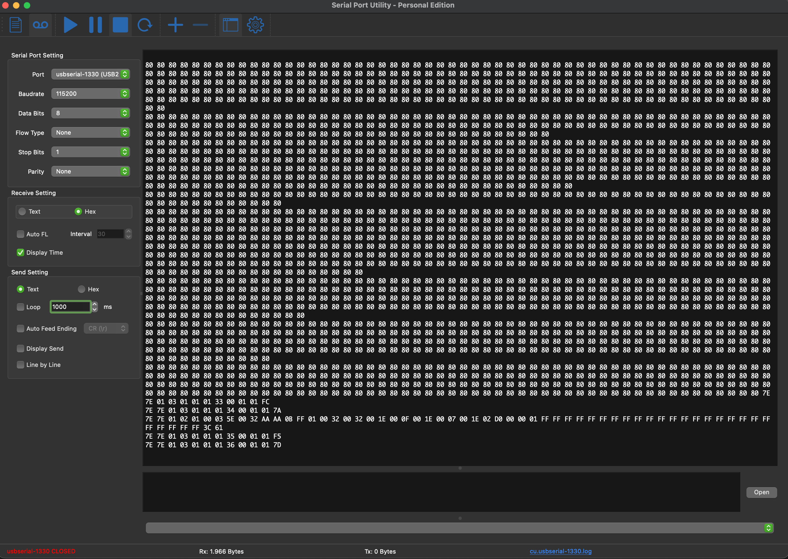
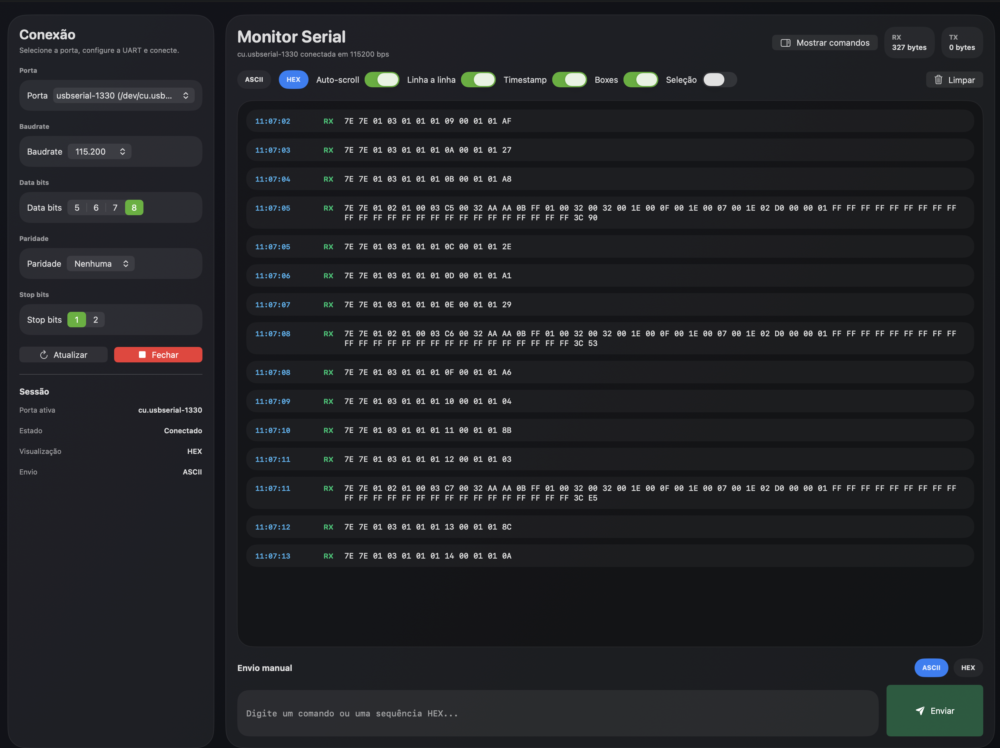
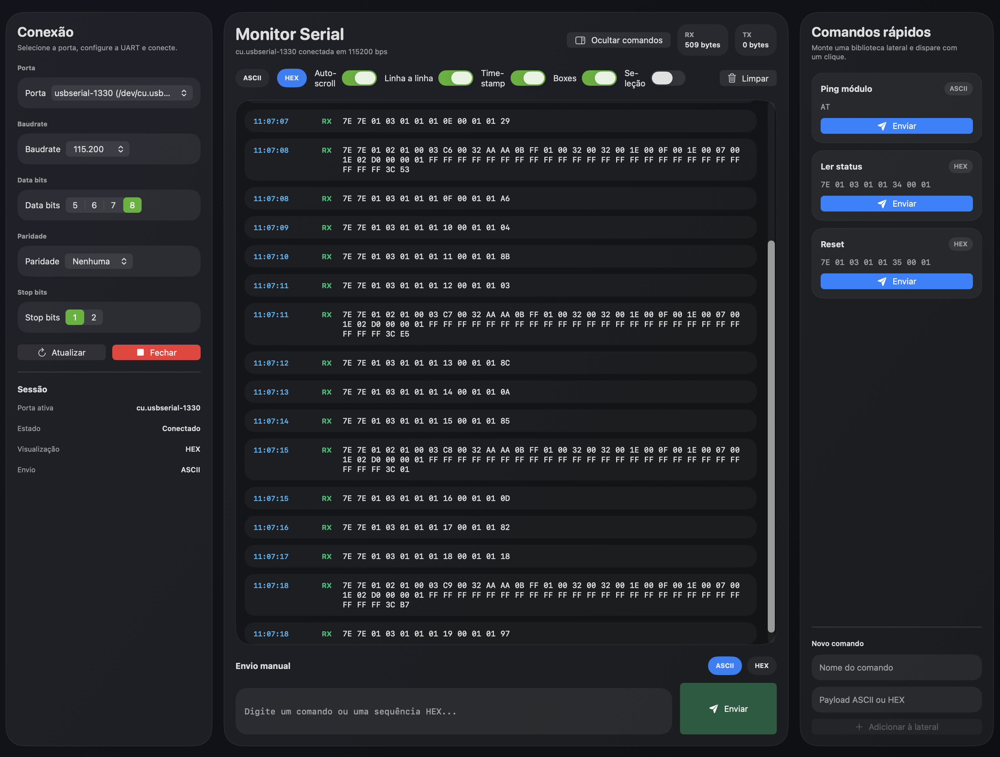

# MonitorSerial

Monitor serial para macOS, feito em SwiftUI, com foco em leitura contínua de UART, visualização em `HEX` ou `ASCII`, envio manual de comandos e biblioteca lateral de comandos rápidos.

## Destaques

- Seleção de porta serial com prioridade para interfaces `usbserial`
- Configuração de `baudrate`, `data bits`, `paridade` e `stop bits`
- Visualização de recepção em `HEX` ou `ASCII`
- Log com timestamp, auto-scroll, modo linha a linha e opção de seleção de texto
- Envio manual de comandos
- Biblioteca de comandos rápidos com persistência local
- Interface moderna para uso contínuo em bancada

## Capturas

### Referência visual

Imagem de referência do comportamento desejado:

### Tela principal

Visualização principal do monitor serial com painel de conexão, console central e envio manual:

### Comandos rápidos

Painel lateral com comandos rápidos recolhível:

## Como abrir

1. Abra o projeto `MonitorSerial.xcodeproj` no Xcode.
2. Selecione o target `MonitorSerial`.
3. Rode o app no macOS.

## Observações

- Os comandos rápidos são salvos localmente e recarregados ao abrir o app.
- O projeto foi pensado para macOS.
- Para acesso serial, o comportamento pode variar conforme permissões e configuração local do sistema.
